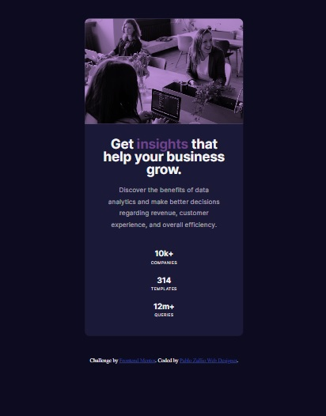

# Frontend Mentor - Stats preview card component

## Description

Component made through a challenge of the _Frontend Mentor_ page.
In it we can see a card as a component with text and image.
The work is made with a _Movil First_ design, in addition to using tools like _Flexbox_.

## Image

### Version Mobile

### Version Desktop

## Link

https://zalliopablo.github.io/new-component-card
